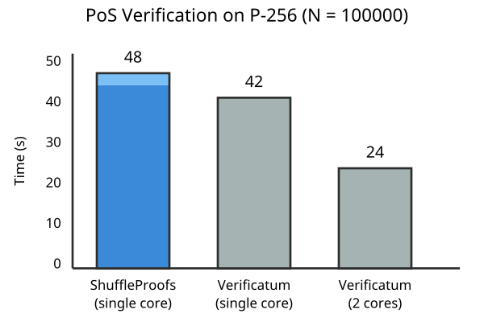
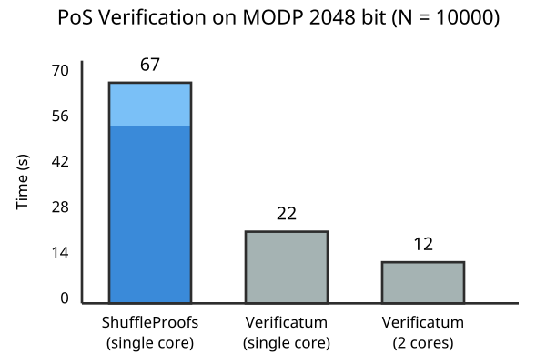
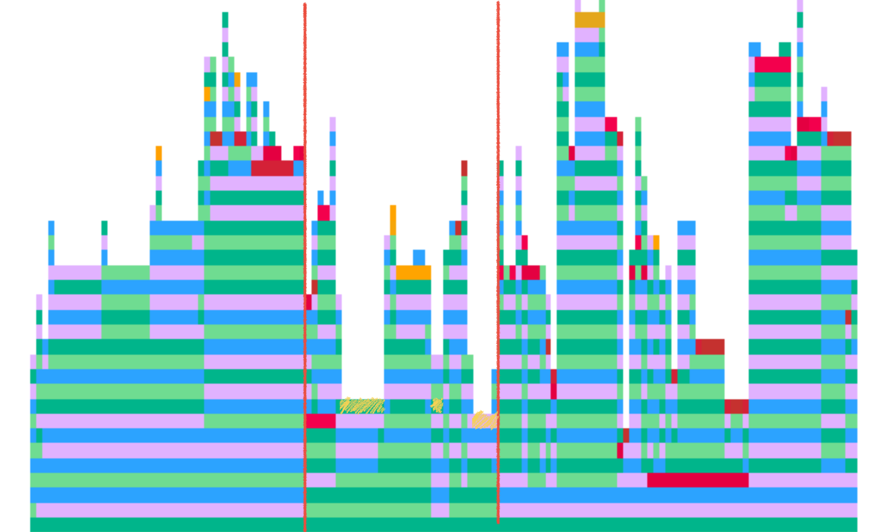

# ShuffleProofs.jl

[](https://codecov.io/gh/PeaceFounder/ShuffleProofs.jl)

ShuffleProofs.jl is a high-performance Julia package implementing zero-knowledge proofs of shuffle, primarily designed for E2E verifiable e-voting systems and privacy-preserving applications. The package implements the Wikström proof of shuffle protocol with Verificatum compatibility, matching the protocol deployed in national-scale electronic voting systems across Estonia, Norway, and Switzerland.

## Why ShuffleProofs.jl?

Traditional cryptographic tools often focus solely on confidentiality and security. However, modern systems like electronic voting require privacy to unlink voters from their votes and verifiability, proving that every vote tallied had come from at most one eligible voter.  ShuffleProofs.jl addresses part of this complex challenge through ElGamal reencryption shuffle.

- **Standards-Compliant**: Compatible with the battle-tested Verificatum verifier specification
- **Flexible Design**: Supports various cryptographic groups and custom verification strategies
- **Developer-Friendly**: Clean, type-safe implementation with comprehensive testing that closely matches [Haenni et al.](https://link.springer.com/chapter/10.1007/978-3-319-70278-0_23#citeas) pseudocode
- **Enabling Ecosystem**: Easily reuses [CryptoPRG](https://github.com/PeaceFounder/CryptoPRG.jl), [CryptoGroups](https://github.com/PeaceFounder/CryptoGroups.jl), [OpenSSLGroups](https://github.com/PeaceFounder/OpenSSLGroups.jl) and [SigmaProofs](https://github.com/PeaceFounder/SigmaProofs.jl) for other supporting zero-knowledge proofs and transition seamlessly from prototyping to production environments
- **High Performance**: Competitive with Verificatum on single-core benchmarks




*Note: Light blue sections show the time taken for a proposition, proof deserialisation, and group membership validation in ShuffleProofs. The benchmarks for the P-256 group have been made using the implementation from OpenSSLGroups. Both quadratic residue prime group with 2048-bit prime modulus and NIST standard curve P-256 group offer 128-bit security for discrete logarithm problems. Performance tests made with Ubuntu 24.04 on M1 Pro. The benchmark figures have been made with code in `test/benchmarks/benchmark.jl`*

## Installation

```julia
using Pkg
Pkg.add("ShuffleProofs")
```

The package is registered in Julia's general registry and can be installed with the standard package manager on Julia-supported platforms: Linux, MacOS, Windows, FreeBSD and others. All dependencies are automatically handled during installation; no binary artefacts are compiled locally. Hence, the package shall work robustly for all future environments with few updates.

## Core Features

### Cryptographic Capabilities
- Zero-knowledge proof generation and verification for ElGamal reencryption shuffles
- Support for verifiable braiding proofs for public key anonymization
- Extended ciphertext width support

### Group Support
- Native elliptic curves (P-192, P-256, secp256k1)
- High-performance OpenSSL curve integration via [OpenSSLGroups.jl](https://github.com/PeaceFounder/OpenSSLGroups.jl)
- Modular prime groups with flexible parameter selection
- Extensible interface for custom group implementations and hardware optimisations

### Verificatum Compatibility
- Full compatibility with Verificatum's proof of shuffle verifier specification
- Support for loading and verifying Verificatum-generated proofs
- Flexible verifier interface for custom implementations
- Reorganised, flat directory structure for proof serialisations while complying with file specifications

## Quick Start: E-Voting Example

Here's how to implement a basic e-voting system with anonymous vote collection and verifiable counting:

```julia
using CryptoGroups
using SigmaProofs.ElGamal: Enc, ElGamalRow
using SigmaProofs.DecryptionProofs: decrypt
using SigmaProofs.Verificatum: ProtocolSpec
using ShuffleProofs: shuffle, verify

# Setup
g = @ECGroup{P_192}()
verifier = ProtocolSpec(; g)
sk = 123  # Secret key (in practice, distributed in threshold ceremony)
pk = g^sk
options = [g, g^2, g^3]  # Voting options

# 1. Collect encrypted votes
bbord = let
    enc = Enc(pk, g)
    ciphertexts_in = [enc(options[rand(1:3)], rand(1:10)) |> ElGamalRow for i in 1:10]
    (; ciphertexts_in)
end

# 2. Shuffle votes anonymously with proof
bbord = let
    simulator = shuffle(bbord.ciphertexts_in, g, pk, verifier)
    (; bbord..., 
       ciphertexts_out = simulator.proposition.𝐞′,
       shuffle_proof = simulator.proof)
end

# 3. Decrypt with proof
bbord = let
    simulator = decrypt(g, bbord.ciphertexts_out, sk, verifier)
    (; bbord...,
       votes = simulator.proposition.plaintexts,
       dec_proof = simulator.proof)
end
```

This example demonstrates a complete electronic voting workflow: vote submission, shuffling, and decryption. The process ensures that while votes remain anonymous, the entire process is verifiable. Each step produces cryptographic proofs that can be independently verified, ensuring that no votes have been added, removed, or modified during the process.

The bulletin board (`bbord`) acts as a public ledger where all operations are recorded along with their proofs. This transparency allows anyone to verify the integrity of the election while maintaining voter privacy through the shuffle mechanism. 

For ShuffleProofs, the important lines are:
```julia
simulator = shuffle(bbord.ciphertexts_in, enc, verifier)
```
which creates a simulator containing proposition, proof and verifier as its fields, which can be verified with the:
```julia
verify(proposition, proof, verifier)
```
This allows any party to independently verify that a shuffle was performed correctly without learning anything about the actual permutation used. To assure integrity, one then only needs to verify the verifier specification parameters accessible with the `simulator.verifier`, whereas `simulator.proposition` contains all data in one place to chain multiple shuffles together in a larger part of the protocol.


## Braiding Example

Braiding allows for anonymous group signatures. Here's how to use it:

```julia
using CryptoGroups
using ShuffleProofs

# Setup
_curve = curve("P-256")
G = specialize(ECGroup, _curve, name = :P_256)
g = G(generator(_curve))

# Create member keys
y = [4, 2, 3]
Y = g .^ y

# Perform braiding
verifier = ProtocolSpec(;g)
simulator = braid(Y, g, verifier)

# Verify braiding
@assert verify(simulator)

# Get outputs
h = output_generator(simulator.proposition)
Y′ = output_members(simulator.proposition)

# Verify membership preservation
@assert sort(h .^ y) == sort(Y′)
```

Braiding is an advanced feature that creates knot-like structures where inputs are related to outputs through privately known exponents. This is particularly useful in scenarios where group members need to prove their membership without revealing their identity, such as whistleblower protection systems or voting systems where votes are signed pseudonymously.

## Working with Verificatum

To verify proofs generated by Verificatum:

```julia
simulator = load_verificatum_simulator(DEMO_DIR)
verify(simulator)
```

Verificatum compatibility is a key feature of ShuffleProofs.jl, allowing it to interoperate with one of the most widely deployed mix-net systems. This means proofs generated by Verificatum can be verified using this package and vice versa (in principle, if serialisation were to follow the directory structure of Verificatum specification). The implementation follows Verificatum's rigorous specification, ensuring complete compatibility.

## Custom Verifiers

The package supports custom verifier implementations:

```julia
struct HonestVerifier{T} <: Verifier
    challenge::PoSChallenge
end

generator_basis(verifier::HonestVerifier, G, n) = verifier.challenge.𝐡
challenge_perm(verifier::HonestVerifier, proposition, 𝐜) = verifier.challenge.𝐮
challenge_reenc(verifier::HonestVerifier, proposition, 𝐜, 𝐜̂, t) = verifier.challenge.c
```

The verifier architecture is designed to be extensible, allowing users to implement custom verification strategies. This is particularly useful for specialised applications or research purposes where the standard verification process needs to be modified. 

## Performance
### Performance Analysis

- **Elliptic Curves**: ShuffleProofs matches Verificatum's single-core performance when using OpenSSL integration
- **Modular Prime Groups**: 
  - A group membership validation via [hand-crafted Jacobi symbol calculations](https://github.com/PeaceFounder/CryptoGroups.jl/blob/0f6b4e223225634ec1506e6999f8922c079f62c7/src/Utils.jl#L24) takes a significant amount of verification time in ShuffleProofs 
  - Verificatum likely uses optimised Montgomery arithmetic (not yet implemented in ShuffleProofs) and simultaneous exponentiation also for membership validation
- **Parallelism** Verificatum takes advantage of multiple cores in the system, as shown in performance benchmarks.

In addition, Verificatum is much more optimal in memory usage, offloading intermediate calculations to the disk, whereas ShuffleProofs keeps them all in memory, hence the large memory footprint. It would be interesting to explore in the future whether performance can be preserved with a generic disk-supported vector type streamed from a disk. 

### Performance Profiling



Performance profiling reveals three major computational bottlenecks in the code: generator basis computation via `generator_basis` consumes 40% of execution time (left), verification of proof through group operations takes another 40% (right), and challenge generation via `challenge_perm` and `challenge_reenc` accounts for the remaining 20% (middle). While the generator basis computation and proof verification stages can be readily parallelised using either multithreading or multiprocessing, the challenge generation stage presents parallelisation roadblocks. Within this challenge generation phase, approximately 1/3rd of processing time is spent computing hashes from byte vectors using Nettle (highlighted in the profile view with yellow pencil fill). Hence, the specification would need to introduce block-wise hashing to parallelise this part. Nevertheless, 10x speedup is feasible with current specifications, as Verificatum demonstrates.

### Performance Tips

1. **Elliptic Curves** significantly outperform modular prime groups at equivalent security levels and require less memory
2. **OpenSSL** provides a 25x speedup for elliptic curve operations over CryptoGroups basic implementation. OpenSSL can be used with the OpenSSLGroups package as follows:
```julia
using OpenSSLGroups
g = @ECGroup{OpenSSLGroups.Prime256v1}()
verifier = ProtocolSpec(; g)

# Rest of your code remains the same but runs much faster!
```
3. **Memory Usage:** ensure your machine has sufficient RAM to avoid disk swapping - for example, processing 1,000,000 ciphertexts requires approximately 16GB of RAM


## References

- Wikstrom, "How To Implement A Stand-Alone Verifier for the Verificatum Mix-Net"
- Wikström, "A Commitment-Consistent Proof of a Shuffle"
- Wikström, "User Manual for the Verificatum Mix-Net"
- Haenni et al., "Pseudo-Code Algorithms for Verifiable Re-Encryption Mix-Nets"
- [verificatum.org](https://verificatum.org)

These references provide the theoretical foundation and implementation details for the protocols used in this package. They are essential reading for understanding the security properties and mathematical underpinnings of the shuffle proofs.
